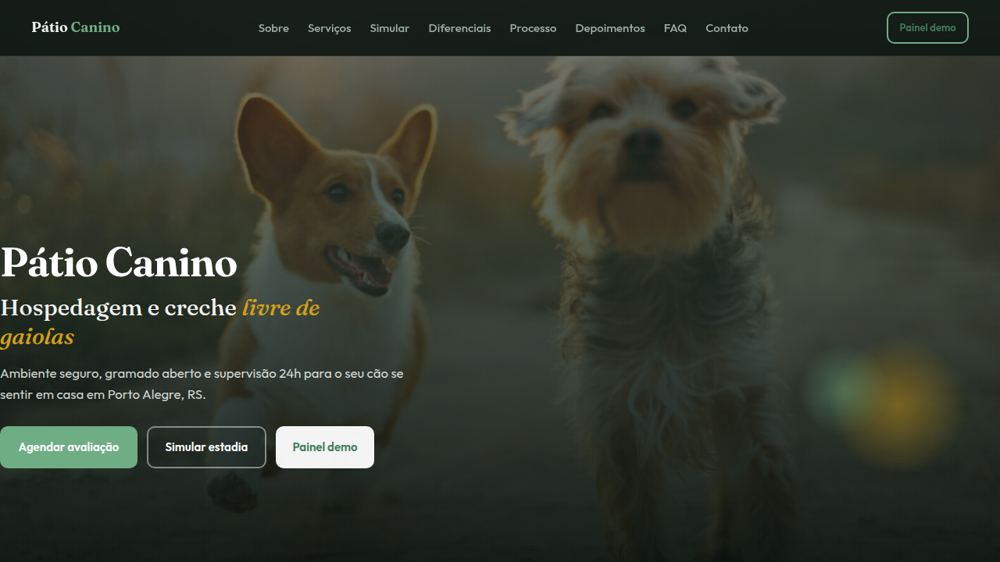
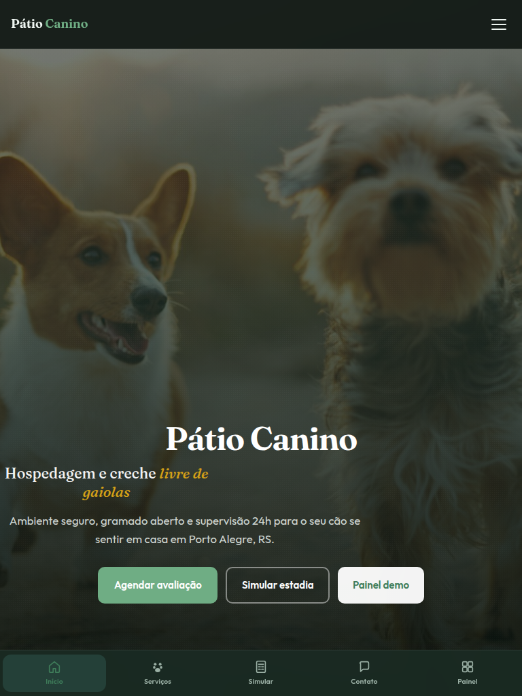
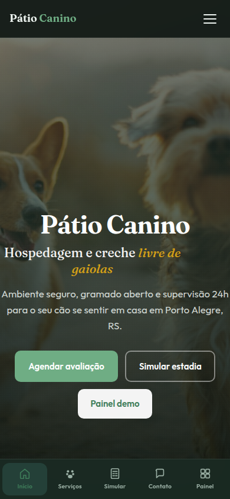

# Pátio Canino — Landing & Painel Demo

Demo completo para hospedagem e creche de cães em React + Vite: landing de alta conversão com simulador de estadia, formulário WhatsApp e mini-app de gestão de tutores, reservas e serviços (localStorage).

Inspirado em [Dog Yard](https://dogyard.com.br/) e [Dog Host](https://doghost.net.br/).

[](https://tofariasti.github.io/landing-patio-canino/)

## Demo

**Moldura (preview):** [https://tofariasti.github.io/landing-patio-canino/](https://tofariasti.github.io/landing-patio-canino/)

**Tela cheia:** [https://tofariasti.github.io/landing-patio-canino/site/](https://tofariasti.github.io/landing-patio-canino/site/)

## Screenshots

### Desktop (1280px)


### Tablet (768px)


### Mobile (390px)


## Funcionalidades

### Landing pública
- Hero full-bleed com marca em destaque e CTAs WhatsApp
- Sobre, serviços, diferenciais (livre de gaiolas)
- **Simulador de estadia** interativo (dias/sessões + extras)
- Depoimentos, FAQ accordion
- Formulário estruturado → WhatsApp
- Botão flutuante WhatsApp com imagem customizada
- **Dock mobile** estilo app nativo (safe-area)

### Mini-app (painel demo)
- Dashboard com resumo e próximos check-outs
- CRUD de tutores (localStorage)
- Reservas com status (agendado → concluído) e extras
- Tabela de serviços/preços editável
- Configurações: tema claro/escuro, reset demo

## Design

### Tipografia
- **Outfit** — corpo, UI e labels
- **Fraunces** — títulos e marca

### Tokens CSS (documentados em `src/styles/global.css`)
| Token | Light | Uso |
|-------|-------|-----|
| `--color-primary` | `#3F7D5A` | CTAs, links, acentos |
| `--color-honey` | `#D4A017` | Destaques quentes |
| `--color-hero-from/via/to` | cedro profundo | Hero overlay |
| `--color-mint` | `#8EC9A8` | Frescor / accents |
| `--color-bg` | `#EEF5F1` | Fundo sage |

## Tecnologias

- React 19 + TypeScript + Vite
- React Router (HashRouter)
- Framer Motion
- Vitest + Testing Library
- Playwright + axe-core
- GitHub Pages

## Testes

```bash
npm test              # Vitest (unit/integration)
npm run test:e2e      # Playwright (requer build + servidor)
```

## Desenvolvimento local

```bash
npm install
npm run images        # Baixa fotos Unsplash
npm run dev           # Vite dev server
npm run build         # Build para site/
python3 -m http.server 8765   # Moldura + site
```

## Testes de Responsividade

| Dispositivo | Resolução | Status | Verificado |
|-------------|-----------|--------|------------|
| iPhone SE | 375×667 | ✅ | Dock nativo, formulário, simulador |
| iPhone 14 | 390×844 | ✅ | Hero full-bleed, WhatsApp float |
| iPad | 768×1024 | ✅ | Grid serviços, FAQ |
| Desktop HD | 1280×720 | ✅ | Layout completo, moldura |
| Desktop FHD | 1920×1080 | ✅ | Max-width container |

## Acessibilidade

- WCAG 2.1 AA (contraste, foco, labels)
- Skip link, landmarks, ARIA
- `prefers-reduced-motion` respeitado
- Checklist: [docs/a11y-checklist.md](docs/a11y-checklist.md)

## Estrutura

```
patiocanino/
├── index.html          # Moldura preview
├── public/             # favicon, imagens, whatsapp-float.png
├── src/
│   ├── components/landing/
│   ├── components/app/
│   ├── pages/
│   └── styles/
└── site/               # Build (GitHub Pages)
```

## Licença

Demo conceitual — Farias Digital.
